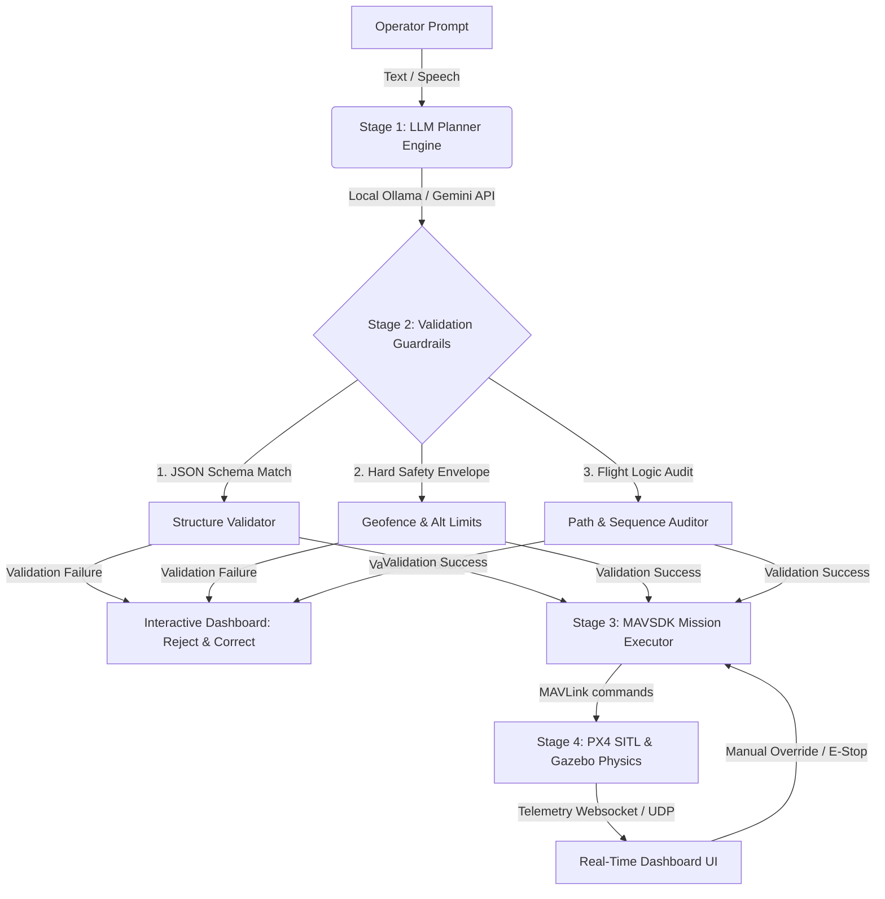

# 🚁 AI-Powered Drone Mission Pipeline & Autonomous Control Stack

[](https://python.org)
[](https://px4.io/)
[](https://gazebosim.org)
[](https://mavsdk.mavlink.io/)
[](LICENSE)

An enterprise-grade, safety-critical mission planning, validation, and execution pipeline for autonomous unmanned aerial vehicles (UAVs). This stack decouples **probabilistic NLP/LLM reasoning** from **deterministic flight controls**, translating high-level operator commands into verified flight paths executed in real-time on PX4-simulated UAVs in Gazebo Classic.

---

## 📌 System Architecture & Dataflow

To meet industrial safety standards, the flight execution layer is strictly isolated from the AI inference engine. The LLM acts solely as a mission generator, and its outputs are audited by a deterministic safety validation engine before MAVLink transmission.



---

## 🛠️ Pipeline Deep-Dive

### **Stage 1: LLM Planner (Probabilistic Intent Processing)**
* **Inference Routing**: Utilizes a dual-engine architecture:
  * **Online Mode**: High-fidelity translation via Google Gemini Flash models.
  * **Offline Mode**: Local, privacy-preserving inference using Ollama running a custom-parameterized `llama3.2:1b` model.
* **Instruction Parsing**: Converts raw natural language (e.g., *"Arm, takeoff to 10m, fly to waypoint A at 5m/s, wait 5 seconds, then RTL"*) into structured JSON missions complying with OGC standards.

### **Stage 2: Deterministic Safety Validation (Guardrails)**
No AI-generated mission can bypass this module. Every JSON payload is processed through a strict pipeline:
1. **Syntactic Check**: Validates properties, coordinates, and types against `mission_schema.json`.
2. **Physical Boundary Checks**: Enforces hard limit checks configured in `safety_limits.yaml`:
   * **Max Altitude**: $50\,\text{m}$ AGL.
   * **Max Velocity**: $15\,\text{m/s}$.
   * **Max Range (Geofence)**: $200\,\text{m}$ cylinder centered around the initial home coordinates.
3. **Behavioral Consistency Checking**: Validates flight state sequences (e.g., rejecting paths that command coordinates without taking off, or missions missing landing/RTL commands).

### **Stage 3: MAVSDK Core & Execution Engine**
* **Offboard Servo Loop**: Translates waypoints into local North-East-Down (NED) frame position commands or global GPS coordinates.
* **Accuracy Constraints**: Implements path-following with an adjustable waypoint arrival tolerance (defaulting to sub-2-meter radius).
* **Telemetry & Audit Logging**: The `AuditLog` module captures telemetry data (roll, pitch, yaw, GPS, battery, system status) at $10\,\text{Hz}$ and logs all flight events to a secure log file for compliance.

### **Stage 4: SITL Simulation (PX4 & Gazebo Classic)**
* Executes flight plans in a Software-In-The-Loop environment reproducing realistic drone kinematics, motor lag, wind profiles, and IMU noise.

---

## 🚀 Advanced Operating Modes

| Mode | Technology | Description |
| :--- | :--- | :--- |
| **Standard Single Drone** | MAVSDK Position Control | Evaluates, translates, and flies structured single-drone trajectories. |
| **Multi-Agent Swarm** | 5-Stage LLM Chain + 10Hz `SwarmOrchestrator` | Synchronizes up to 5 drones (`Leader`, `Follower 1..N`) with dynamic heading-rotated formation tracking and 1.0m altitude-stacking collision avoidance across `FORMATION`, `INDEPENDENT`, `MIXED`, and `REGROUP` modes. Operates a unified 5-stage AI planning pipeline (`Classify Intent` → `Leader Actions` → `Formation Params` → `Follower Waypoints` → `Pydantic Repair Loop`). |

---

## 📂 Codebase Topology

```
drone_pipeline/
├── README.md                      # Project documentation
├── requirements.txt               # Python package dependencies
├── setup.sh                       # One-click client dependency installation script
├── setup_check.sh                 # Environment compatibility verification script
├── launch_sim.sh                  # PX4 SITL & Gazebo launch orchestrator (supports --mode swarm)
├── run_mission.py                 # CLI entrypoint for mission execution
│
├── config/
│   ├── safety_limits.yaml         # Configurable threshold values (geofence, speed, alt)
│   └── waypoint_library.yaml      # Static route libraries and waypoint presets
│
├── src/
│   ├── llm_planner.py             # Unified 5-stage sequential LLM planner (Intent, Leader, Formation, Follower, Repair)
│   ├── mission_validator.py       # Enforces schema validation and swarm safety guardrails
│   ├── executor.py                # Translates mission JSON -> MAVSDK single-drone commands
│   ├── executors/
│   │   └── swarm_executor.py      # Entrypoint mapping Swarm missions to SwarmOrchestrator
│   └── utils.py                   # Parsing helpers, configurations, and audit loggers
│
├── swarm_backend/
│   ├── config/
│   │   └── schema.py              # Definitive Pydantic schemas (Mission, FormationConfig, DroneAgent)
│   ├── core/
│   │   ├── orchestrator.py        # SwarmOrchestrator managing concurrent multi-drone execution loops
│   │   ├── formation.py           # 10Hz geometric formation tracking and offset computation
│   │   ├── collision.py           # Safety guardrails and inter-agent distance checking
│   │   └── swarm_state.py         # Thread-safe in-memory telemetry state bus
│   └── tests/                     # Automated test suite (E2E pipeline, orchestrator, collision, schema)
│
└── web_dashboard/
    ├── app.py                     # FastAPI web server, multi-drone websocket telemetry relayer, process auto-cleanup
    ├── index.html                 # UI cockpit with 5-stage LLM tab breakdown and dynamic multi-drone map canvas
    └── style.css                  # Modern dark-mode UI styles
```

---

## 💻 Installation & Preflight Configuration

### **1. System Dependencies**
Ensure your local host runs:
* Ubuntu 22.04 LTS
* ROS 2 Humble (Desktop Installation recommended)
* Gazebo Classic 11
* PX4-Autopilot directory located at `~/PX4-Autopilot` (built using `make px4_sitl_default`)
* Python 3.10+ with pip

### **2. Repository Setup**
Clone the repository and install requirements:
```bash
git clone https://github.com/shinde0001/Drone-Mission-Pipeline.git
cd Drone-Mission-Pipeline
bash setup.sh
# Or manually install with: pip3 install -r requirements.txt
```

### **3. Environment Validation**
Run the diagnostic script to verify PX4 installations, path configurations, and local LLM connectivity:
```bash
bash setup_check.sh
```

---

## ✈️ Flight Operations Playbook

### **Step 1: Spin up SITL Environment**
Instantiate the virtual gazebo environment and PX4 stack:
```bash
bash launch_sim.sh
```

### **Step 2: Start the Flight Cockpit Backend**
Launch the FastAPI telemetry relayer and web dashboard:
```bash
python3 web_dashboard/app.py
```
Open **`http://localhost:8000`** in a browser.

### **Step 3: CLI Direct Execution (Alternative)**
For scripting or headless environments, use the Python CLI interface:
```bash
# Interactively plan and run a mission
python3 run_mission.py

# Send prompt directly to execution pipeline
python3 run_mission.py --prompt "Patrol square boundary 15 meters at 10m height"

# Plan and validate only (does not arm drone)
python3 run_mission.py --prompt "Takeoff 25m, fly east 30m, and land" --dry-run
```

---

## 🔒 Safety Systems & Failsafes

* **Geofence Enforcement**: If any coordinate in a mission falls outside the radial/altitude geofence defined in `safety_limits.yaml`, the validator blocks execution and reports the violating coordinates.
* **Active Manual Override**: Telemetry panel includes a hardware interrupt emulator. Pressing **HOLD**, **RTL**, or **LAND** immediately terminates offboard control and hands authority back to native autopilot modes.
* **Signal Loss Recovery**: If the network connection between the controller and PX4 drops, the autopilot triggers its native PX4 Failsafe (RTL or Land based on configurations).

---

## 🧪 Testing & Verification

The project includes an exhaustive automated unit and integration test suite covering the full multi-agent swarm architecture:
```bash
# Run all tests (Schema, Parser, Formation Math, Safety Envelope, Collision Avoidance, Orchestrator, E2E Pipeline)
python3 -m pytest -p no:anyio swarm_backend/tests/
```
