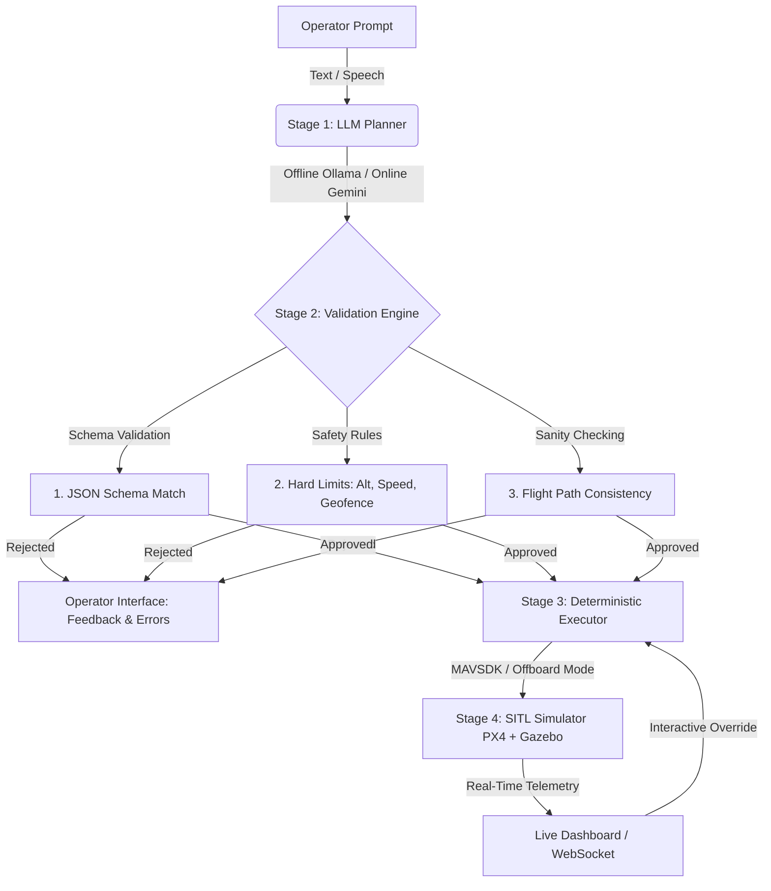

# 🚁 AI-Powered Drone Mission Pipeline

[](https://python.org)
[](https://px4.io/)
[](https://gazebosim.org)
[](https://mavsdk.mavlink.io/)
[](LICENSE)

An enterprise-grade, safety-first mission planning and execution pipeline for autonomous drones. This system translates natural-language operator commands into structured missions via Large Language Models (LLMs), runs them through a multi-tier deterministic validation suite, and executes them in real-time on PX4-simulated UAVs in Gazebo.

---

## 📌 Architectural Overview

This system separates **probabilistic AI reasoning** from **deterministic flight execution** to enforce strict safety guarantees. The LLM never commands the vehicle directly.



---

## 🛠️ Key Pipeline Stages

### **Stage 1: LLM Planner (Intent Processing)**
* Translates complex operator prompts (e.g., *"Patrol a square loop of 20 meters at 10m altitude, repeat twice"*) into structured JSON missions.
* Supports **Online Mode** (Gemini 3.5 Flash API for high accuracy) and **Offline Mode** (Local Ollama running `llama3.2:1b` for absolute privacy and low latency).
* Features a fallback prompt architecture with predefined waypoint libraries and local presets.

### **Stage 2: Validation Engine (Safety Guardrails)**
Every proposed mission is scanned through three strict layers of verification:
1. **Schema Check:** Verifies JSON compliance against `mission_schema.json`.
2. **Safety Hard Limits:** Rejects any flight path exceeding maximum altitude (50m), speed (15m/s), or geofence boundary (200m radius from home).
3. **Flight Logic Sanity:** Ensures correct initialization (starts with takeoff), appropriate navigation bounds, spacing between waypoints, and safe termination sequences (concludes with land or Return to Launch).

### **Stage 3: Deterministic Executor (MAVSDK Core)**
* Takes validated JSON files and translates them into sequential MAVLink commands via MAVSDK.
* Uses **Offboard Position Control (NED frame)** to navigate trajectories with a precision-based waypoint arrival tolerance (2.0 meters).
* Features an audit logging module (`AuditLog`) which logs every command, flight event, and telemetry change for compliance auditing.

### **Stage 4: Simulation Environment (PX4 & Gazebo)**
* Executes flight plans inside a Software-In-The-Loop (SITL) PX4-Autopilot environment.
* Runs full physics simulation (wind, gravity, motor inertia) inside Gazebo Classic.

---

## 🚀 Advanced Operating Modes

The dashboard supports four highly optimized mission control configurations:

1. **Standard Pipeline:** Single-UAV mission planning, telemetry tracking, and structured trajectory execution.
2. **Multi-agent Formations (Swarms):** Coordinates up to 5 drones in real-time using formation constraints (Wedge, Line, or Column layouts).
3. **SLAM & Navigation:** Autonomous boundary-restricted exploration for building interior maps and 2D terrain reconstruction.
4. **Vision AI Target Follow:** Connects computer vision target classes (e.g., identifying and tracking people, boxes, or vehicles) to active offboard movement override systems.

---

## 📂 Project Structure

```
drone_pipeline/
├── README.md                      # Project Documentation
├── requirements.txt               # Python Package Dependencies
├── setup_check.sh                 # Environment Compatibility Verification
├── launch_sim.sh                  # PX4 SITL & Gazebo Launch Orchestrator
├── run_mission.py                 # Main Command-Line Entrypoint
│
├── config/
│   ├── mission_schema.json        # Mission validation JSON schema
│   ├── safety_limits.yaml         # Configurable flight safety constraints
│   └── waypoint_library.yaml      # Static route libraries and waypoint definitions
│
├── src/
│   ├── llm_planner.py             # Natural Language to Mission JSON translator
│   ├── mission_validator.py       # Safety boundaries and structural validator
│   ├── executor.py                # Single UAV MAVSDK flight logic
│   ├── executors/
│   │   ├── swarm_executor.py      # Multi-UAV swarm coordinator
│   │   ├── slam_executor.py       # Autonomous SLAM search script
│   │   └── vision_executor.py     # OpenCV/Vision target tracking script
│   └── utils.py                   # Parsing libraries, audit logger, and config loaders
│
└── web_dashboard/
    ├── app.py                     # FastAPI websocket backend
    ├── index.html                 # Premium dark-themed dashboard frontend
    └── style.css                  # UI layout styling
```

---

## 💻 Setup & Installation

### 1. System Requirements
* Ubuntu 22.04 LTS
* ROS 2 Humble
* Gazebo Classic 11
* PX4-Autopilot (`~/PX4-Autopilot` built with `make px4_sitl_default`)
* Python 3.8+

### 2. Dependency Installation
Clone this repository and install the required Python libraries:
```bash
git clone https://github.com/shinde0001/Drone-Mission-Pipeline.git
cd Drone-Mission-Pipeline
pip3 install -r requirements.txt
```

### 3. Preflight Setup Verification
Run the diagnostic script to ensure ROS, Gazebo, Python dependencies, and the local Ollama instance are correctly configured:
```bash
bash setup_check.sh
```

---

## ✈️ Getting Started

### **Step 1: Start the SITL Simulator**
Launches PX4 SITL and Gazebo Classic (will run headlessly if no `DISPLAY` environment variable is detected to conserve system RAM):
```bash
bash launch_sim.sh
```

### **Step 2: Start the Web Dashboard**
Run the FastAPI application to serve the interactive web panel:
```bash
python3 web_dashboard/app.py
```
Open your browser and navigate to **`http://localhost:8000`**.

### **Step 3: Run via Command Line (Alternative)**
You can trigger, validate, and execute prompts directly from the CLI:
```bash
# Plan & run a mission interactively
python3 run_mission.py

# Run a specific command immediately
python3 run_mission.py --prompt "Patrol the perimeter loop at 10m height"

# Perform a dry-run (generates and validates plan, but does not launch drone)
python3 run_mission.py --prompt "Take off 15m and land" --dry-run
```

---

## 🔒 Safety & Failsafes

This system implements robust industrial safety protocols:
* **LLM Isolation:** The LLM generates data, never flight commands. A corrupted or malicious LLM payload cannot bypass the validator.
* **Geofencing:** Hard-bounded limits in 3D space (`safety_limits.yaml`). If a waypoint lies outside this boundary, the pipeline blocks execution.
* **Emergency Halt:** The physical/virtual executor supports an instant manual override. Triggering **Hold**, **Return-to-Home (RTH)**, or **Terminate** on the dashboard aborts active mission tasks instantly.
* **Offboard Loss Recovery:** In the event of command stream interruption, the drone immediately triggers its native PX4 failsafe landing sequence.

---

## 📝 License

Distributed under the MIT License. See `LICENSE` for details.
